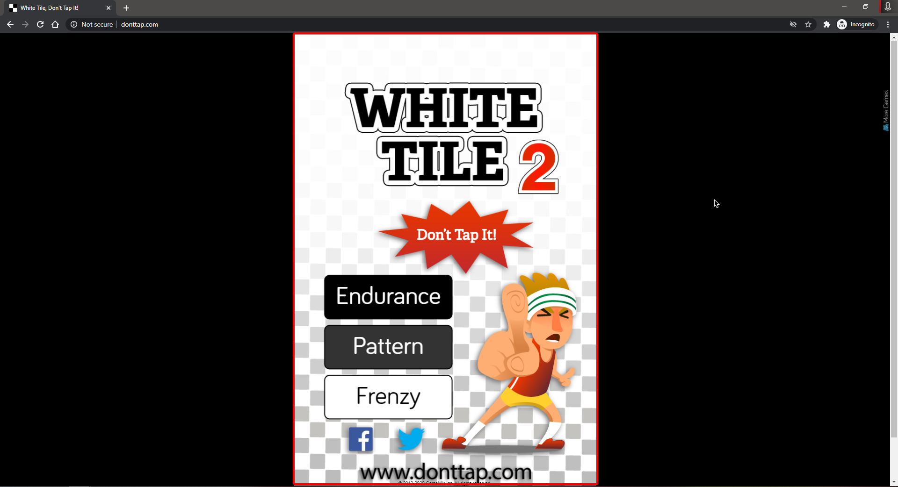

# dont-go
🤖 Bot that plays http://donttap.com

## Usage

Run and provide **x**, **y**, **w**, **h** of the game window:

**x** and **y** should be of the top left corner of the red border as shown below:



Use a tool like [ShareX](https://getsharex.com/) to get the coordinates easily


```bash
$ go run main.go 630 230 640 640
```
